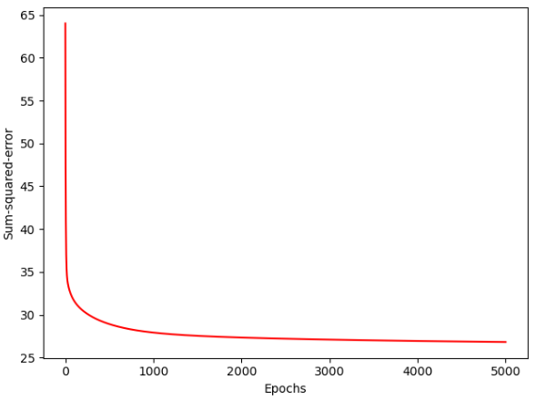
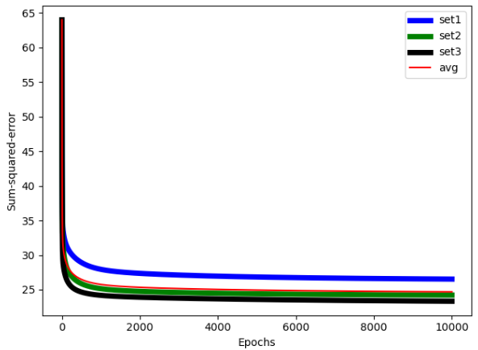

## Adaline

The aim of the project is to create an Adaline model that can predict the verdict of patients according to their symptoms.
In this project, we train our model using real data for the selected number of eras, conduct a test and verify the result.

## Dataset splitting:
<li>66-33%
<li>Cross Validation

## SSE (Sum of squared errors)

## Back Propagation
To compare the results, we also used the Tensorflow back propagation model.
